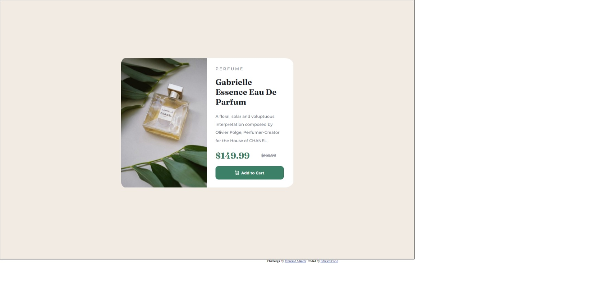

# Frontend Mentor - Product preview card component solution

This is a solution to the [Product preview card component challenge on Frontend Mentor](https://www.frontendmentor.io/challenges/product-preview-card-component-GO7UmttRfa). Frontend Mentor challenges help you improve your coding skills by building realistic projects. 

## Table of contents

- [Overview](#overview)
  - [The challenge](#the-challenge)
  - [Screenshot](#screenshot)
  - [Links](#links)
- [My process](#my-process)
  - [Built with](#built-with)
  - [Continued development](#continued-development)
  - [Useful resources](#useful-resources)
- [Author](#author)

## Overview

### The challenge

Users should be able to:

- View the optimal layout depending on their device's screen size
- See hover and focus states for interactive elements

### Screenshot

### Links

- Solution URL: https://github.com/Ed-CodePower/Frontend_Mentor/tree/main/ProductPreviewCardComponent
- Live Site URL: [Add live site URL here](https://your-live-site-url.com)

## My process

### Built with

- Semantic HTML5 markup
- CSS custom properties

### Continued development

- Practice with layout design
- Try to learn how to set various text stuff like line-height, font-size with CSS or html tags
- Need help to find the information about how to adjust from desktop to mobile size.

### Useful resources

- www.w3school.com/html/ - This helped me to remind myself to what tags/elements to use.
- www.w3school.com/css/  - This helped me to get various properties to set design like margin and padding.

## Author

- Linkin - Edward Cicio
- Frontend Mentor - [@Ed-CodePower](https://www.frontendmentor.io/profile/Ed-CodePower)
